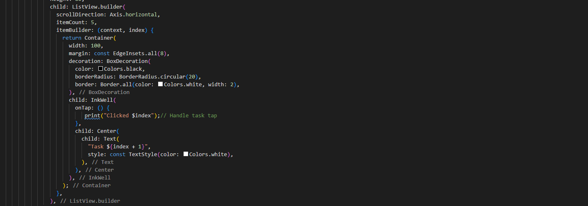
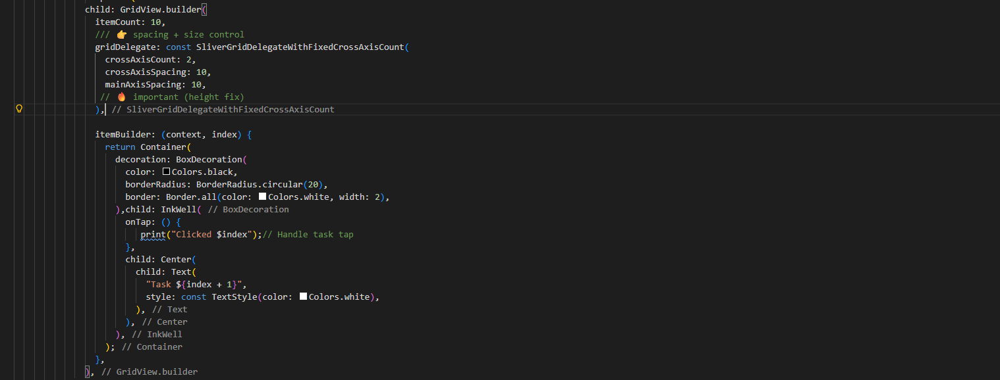
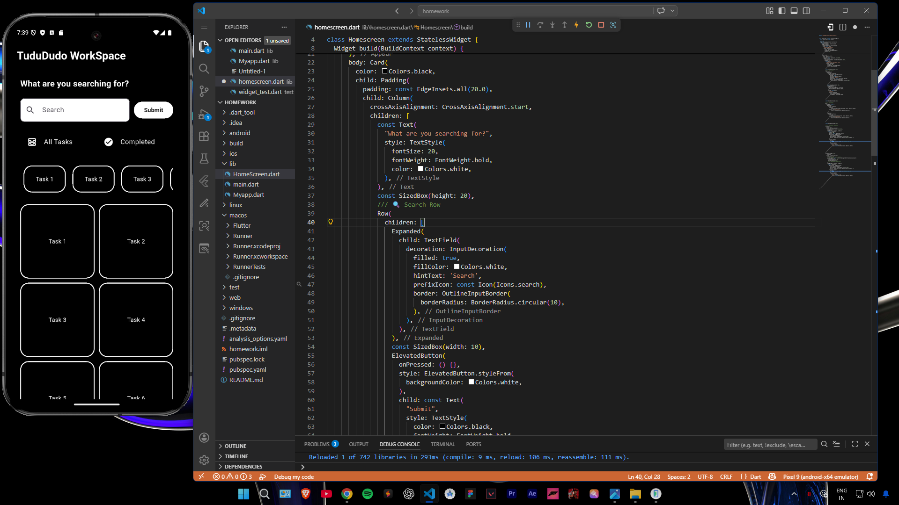
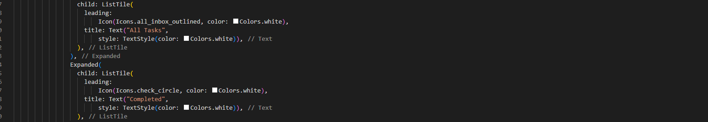
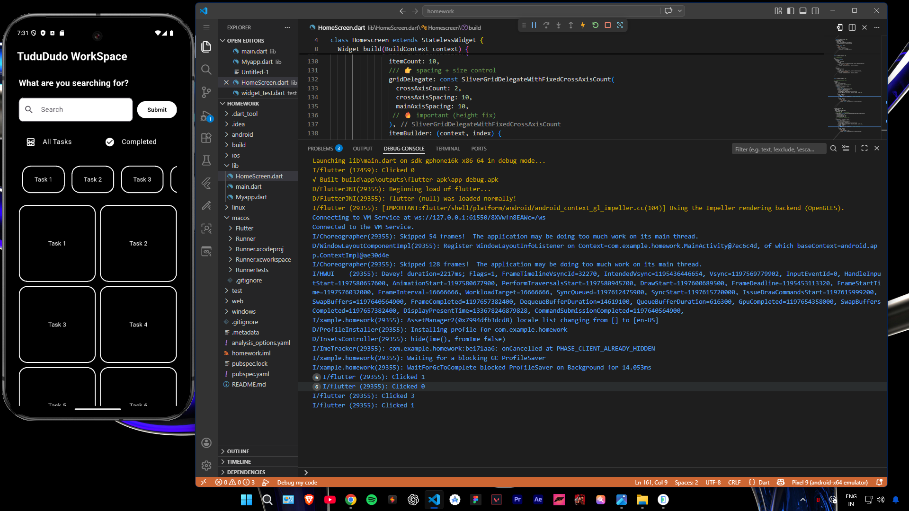

# Task-Basic-2-UI
This task focuses on building a basic Flutter UI using advanced widgets like ListView, GridView, Card, and ListTile. You will create a scrollable screen (list or grid), add user interactions such as button clicks and item taps, and ensure proper layout, spacing, and smooth performance.

**ListView**

**GridView**

**Card**

**listtile**

**Scroll**

**Clicked**

